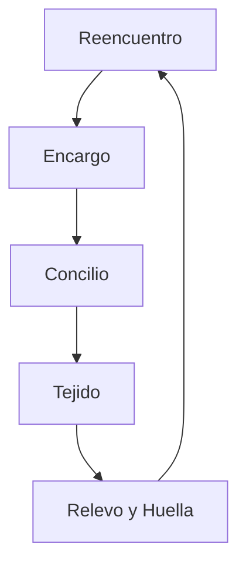

# Propuesta: Telar como interfaz operativa de Engremiat

**Versión**: 1.1 (consolidada)
**Fecha de consolidación**: 2026-09-02
**Estado**: B0, B1, B2 y B3 construidos y verificados en real (`tools/gobierno/telar/`) — contratos + fixtures, interfaz estática interactiva, deliberación real con DeepSeek, y registro controlado con Puerta Humana real contra un destino de prueba. Todo sobre **una sola Misión fija** (el ciclo completo funciona, pero el programa "empieza y acaba" — diagnóstico correcto que abre el arco siguiente, §21).
**Historial**: este documento pasó por cuatro rondas de diseño (propia + tres revisiones externas de otras IAs) que corrigieron imprecisiones reales y añadieron mecánica jugable donde solo había especificación operativa — y en una ocasión (§19.1) rechazó explícitamente una propuesta por prematura, no por incorrecta. Esta versión consolida la decisión vigente de cada punto. El detalle de qué cambió y por qué vive en el **Anexo A** — no en el cuerpo del documento, para que sirva como base estable.
**Relacionado**: [[Telar]] (01_Mundo/Espacios), [[Mensajero]], [[Concilio]], `tools/gobierno/spike_concilio_coop/` (Fase A, construida y verificada en producción en el VPS)

---

## 0. Tesis

Telar es una **sala de control narrativa** donde el Visitante convierte necesidades reales en decisiones trazables **tejiendo** aportes de Personajes, evidencias y límites; cada ciclo deja una consecuencia verificable y una memoria que modifica las misiones futuras.

No es un dashboard de solo lectura ni un mundo explorable con sprites. Tampoco es un chatbot con piel de juego — la diferencia la marca un verbo propio (**tejer**, no "elegir qué IA sigue"), una materia jugable (hechos, propuestas, riesgos, faltantes, disensos), una condición de sentido (consecuencia verificable, no solo un registro técnico) y persistencia (memoria que afecta al futuro, no una sesión que se olvida).

**Rol del operador**: el Visitante — no un mando dando órdenes a los Acervos, sino alguien que entra a ayudar a los Personajes a sacar adelante las Misiones del propio sistema, coautor del resultado, nunca jurado del Concilio.

El lenguaje de juego debe **aumentar** comprensión, pertenencia y responsabilidad. Si una animación, metáfora o mecánica oculta el estado real, ralentiza una tarea frecuente o hace parecer segura una acción no verificada, se elimina.

---

## 1. Investigación aplicada (fuentes contrastadas)

- **MDA** (Hunicke/LeBlanc/Zubek): Mecánicas → Dinámicas → Estética. La estética objetivo es **Fellowship** — pero es un objetivo, no un resultado garantizado por poner una órbita bonita alrededor de una secuencia de botones.
- **XCOM y familia** (BattleTech, Jagged Alliance 3, Battle Brothers): doble capa táctica (una Misión concreta) + estratégica (Espacios/Personajes/Recursos persistentes entre misiones).
- **Frostpunk**: la escasez real de un recurso (`GASTO_API`, tope $5/mes) como motor de decisión — nunca como puntuación a maximizar.
- **Hanabi, estudios de equipos humano-IA**: la preferencia humana por un compañero de IA no depende solo de su resultado objetivo — pesa más ser interpretable y predecible. Telar debe optimizar confianza y previsibilidad de cada Acervo, no solo precisión.
- **Amershi et al., *Guidelines for Human-AI Interaction***: base de las reglas de la Puerta Humana y de nunca ocultar incertidumbre.
- **Erickson & Kellogg, *Social Translucence***: visibilidad, awareness y accountability como los tres requisitos de cualquier sistema colaborativo — la base de la preparación para multijugador (§13).
- **Blades in the Dark (SRD), Progress Clocks**: relojes de progreso útiles si *muestran* una situación real, nunca si la determinan con azar — en Telar solo avanzan por datos o decisiones registradas, nunca por dados.
- **Diseño de niveles — "muestra la cerradura antes que la llave"**: la base de la Puerta Humana.
- **UX 2026 de acciones irreversibles**: patrón Sugerir → Confirmar → Ejecutar, con segundo gate independiente para lo destructivo.
- **JSON Schema como contrato entre agentes** (práctica 2026): validación + reintento acotado con el error como feedback, nunca confiar en la autodeclaración del modelo.

---

## 2. El bucle jugable

Sustituye toda descripción anterior de "fases" o "ciclo de estados" — **este es el único diagrama vigente**:



- **Reencuentro** (30-60s): Narrador dice qué cambió desde la última vez, qué consecuencia produjo la última decisión, qué sigue bloqueado, y el gasto real — nunca "Continuar" como único botón: *Retomar el hilo pendiente* / *Atender una misión nueva* / *Revisar lo que cambió*.
- **Encargo**: el Visitante elige una Misión (máx. 3 recomendadas + acceso a la bandeja completa) y declara un **criterio rector** (seguridad, cuidado, rapidez, coste, aprendizaje... etiquetas no excluyentes, no una puntuación) antes de convocar a nadie.
- **Concilio**: el sistema recomienda 2-3 Acervos y explica por qué ("Acervo Técnico conoce el mecanismo; falta una mirada de impacto humano"). El Visitante acepta, sustituye o convoca un cuarto solo ante un faltante concreto — nunca los 7 por defecto.
- **Tejido** (la mecánica central, §5): el Visitante compone el resultado con los hilos que aportan los Acervos.
- **Relevo y Huella**: decisión humana + consecuencia visible (§8, §2 tabla de estados).

Estado único de una Misión (sustituye los tres modelos distintos que convivían en versiones anteriores):

`sin_seleccionar → orientacion → concilio_convocando → deliberando → tejiendo → esperando_relevo → devuelta (vuelve a tejiendo) | aprobada_sin_ejecutar → puerta_pendiente → puerta_en_curso → puerta_ejecutada | puerta_warn | puerta_err`

Los 5 estados visuales del MVP (§17) son un subconjunto: `sin_seleccionar`, `deliberando`, `tejiendo` (posturas disponibles), `esperando_relevo`, **`huella`** (consecuencia — quinto estado, antes ausente).

---

## 3. El modelo: Misión, Universo, Participante, Contribución, Narrador

### 3.1 Misión

Una Misión **probablemente** corresponde a algo que ya existe con ID real (`TAREA` en Baserow, `INCIDENCIA` en Sheet, fila de `92_BUS_TRABAJO`) — la correspondencia exacta no está verificada y debe comprobarse antes de escribir datos reales bajo ese supuesto.

**Corrección aceptada (cuarta revisión)**: un `origen_literal` singular es insuficiente — una Misión puede surgir de una incidencia, varias tareas y un documento a la vez. Se sustituye por un array:
```json
"origenes": [{ "sistema": "Baserow", "tipoEntidad": "TAREA", "recordId": "...", "versionOrigen": "...", "leidoEn": "...", "politicaEscritura": "solo_lectura" }]
```
La Misión **referencia** registros externos, nunca asume ser equivalente a uno de ellos. Antes de B2 hay que verificar, sistema por sistema: cuál es la fuente de verdad, qué puede leer Telar, qué puede proponer, dónde puede registrar, y qué sistema conserva la autoridad final.

**Origen**: Vigilia procesa su cola nocturna y da el relevo a Acervo Prompter, que aplica su meta-prompting real y deja el resultado en la Bandeja de misiones propuestas. El Visitante ve tres capas, nunca solo la reformulación: **orígenes literales** (consultables, plegados por defecto, nunca eliminados) → **reformulación de Prompter** → **cambios del propio Visitante**.

**Esquema** (ampliado — una Misión no es una TAREA con piel narrativa, es una estructura jugable: *necesidad + afectado + tensión + capacidades disponibles + decisión humana + consecuencia + memoria*):

| Campo | Función |
|---|---|
| `id` | Identidad estable |
| `origenes` | Registros fuente consultables, nunca ocultos (ver arriba) |
| `reformulacion` | Misión propuesta por Prompter |
| `titulo` / `objetivo` | Resultado buscado, legible |
| `por_que_ahora` | Disparador o cambio reciente |
| `afectados` | Personas, proyectos, Espacios o Recursos |
| `tension` | Compensación o conflicto que hace significativa la decisión |
| `criterio_cierre` | Condición observable para terminar |
| `restricciones` | Límites reales |
| `consecuencia_de_esperar` | Qué cambia si no se actúa ahora (puede ser "ninguna conocida") |
| `conocido` / `faltantes` | Hechos verificados / incertidumbres explícitas |
| `reversibilidad` | reversible \| parcialmente reversible \| irreversible \| desconocida |
| `participantes` | Ver §3.3 (Participante) |
| `coste_estimado` / `coste_real` | `GASTO_API`, nunca puntuación |
| `resultado` | El Tejido, versionado |
| `decision_humana` | aprobar \| devolver \| rechazar \| aplazar \| cerrar_como_aprendizaje |
| `consecuencia_verificada` | Cambio observado después (Huella) |
| `memoria` | Huella reutilizable en futuras misiones |

**Desenlaces narrativos legítimos** (no todo lo que no es éxito es `ERR`): evidencia insuficiente, desacuerdo no resuelto, misión aplazada conscientemente, solución parcial, una pregunta nueva más valiosa que la respuesta inicial, hipótesis descartada, aprendizaje sin ejecución. Un fallo técnico (`ERR`) detiene el flujo; un revés narrativo abre una consecuencia o una misión nueva, sin fingir éxito.

**Arquetipos** (para que las misiones no se repitan todas igual): Diagnóstico ("¿qué está ocurriendo realmente?"), Reparación ("¿cómo recuperamos con el menor riesgo?"), Decisión ("¿qué camino elegimos y qué sacrificamos?"), Creación ("¿qué podemos construir juntos?"), Conexión ("¿qué capacidades deben encontrarse?"), Cuidado ("¿cómo sostenemos sin trasladar el daño?"), Investigación ("¿qué necesitamos aprender antes de decidir?"). No todas terminan en ejecución — Investigación y Diagnóstico pueden cerrar bien con una pregunta mejor.

**Gate de preparación, antes de convocar** (adoptado, cuarta revisión): al entrar en Encargo, Telar comprueba si la Misión está lista para deliberar — resultado: `preparada` \| `falta_evidencia` \| `bloqueada_por_dependencia` \| `pausa_aconsejada`. Si falta información fundamental, el sistema propone reformular como Misión de arquetipo Investigación en vez de convocar 3 Acervos a especular. Barato de construir (una comprobación, no una entidad nueva) y recupera algo real de Engremiat: bloqueo, pausa y aprendizaje son desenlaces legítimos, no solo avance.

**Dos intensidades, misma arquitectura** (adoptado, cuarta revisión): convocar Concilio completo para cada microdecisión produce fatiga ceremonial. Dos recorridos:
- **Hilo rápido** — trabajo conocido, reversible, impacto bajo: contexto mínimo, cero o una perspectiva asistida, compromiso directo, aprobación clara, evidencia y registro. Sin Tejido completo.
- **Telar completo** — decisiones ambiguas, costosas, difíciles de revertir, con varias partes afectadas o disenso real: el ciclo completo de §2.

El sistema puede recomendar el recorrido (con motivo explícito), el Visitante conserva el control de cuál usar.

### 3.2 Universo (capa estratégica)

Persistente entre misiones, tres tipos reales en el vault:
- **Espacios** (`01_Mundo/Espacios/`): infraestructura real — VPS, Baserow, Sheet, n8n, Headscale, Telar mismo. Sano/caído, vigilado por Grafana.
- **Personajes** (`02_Personajes/`): 19 reales (`personajes.json`). No solo tono distinto — asimetría útil: cada uno sabe algo que otros no, consulta fuentes distintas, reconoce sus propios límites, produce un tipo de hilo característico (§3.4), y puede discrepar de forma predecible.
- **Recursos** (`01_Mundo/Recursos/`): `GASTO_API` (tope real $5/mes) y `92_BUS_TRABAJO`.

### 3.3 Participante (preparación explícita para multijugador — sin construirlo ahora)

Decidido este turno: **el operador seguirá siendo solo el Visitante por ahora** (tú y yo), pero ningún contrato de datos debe asumir que "Acervo" es una categoría técnica privilegiada, para no reescribir el núcleo cuando llegue una segunda persona real.

Todo evento y toda contribución usan:
```json
{ "actorId": "...", "participantType": "human | ai | system", "roleId": "..." }
```
Este patrón **no es nuevo** — es el mismo que ya usa `ASIGNACION` (N:M polimórfica) en el Sheet real, y el que ya separa `RECLAMADO_POR` de `VERIFICADO_POR` en `92_BUS_TRABAJO`. Se reutiliza, no se inventa uno paralelo.

Con esta abstracción, una futura persona real puede: ser otro Visitante, ocupar un rol especializado (un Acervo), responder a un hilo, revisar/verificar, o recibir un Relevo — sin decidir todavía **cuál** de estos tres modelos será el definitivo:
1. Varios Visitantes cooperan, los Acervos siguen siendo IA.
2. Personas ocupan roles/Personajes junto a IA.
3. Modelo híbrido.

Esta elección se queda **fuera de B0-B3**, pendiente para la ronda de multijugador (§19).

Preparaciones concretas que sí se deciden ya, porque cuestan cero hoy y evitan una reescritura cara después: autoría y marcas temporales en cada contribución; versión de Misión y versión de resultado; idempotencia; aviso de edición concurrente (bloqueo optimista); permisos por acción; historial de cambios; estados `borrador / propuesto / aceptado / retirado` por contribución; resumen de reentrada; disenso/voto como mecanismo opcional, nunca como única forma de gobernanza.

### 3.4 Contribución / Hilo (contrato estructurado)

Sustituye la respuesta de texto libre y la tarjeta indivisible de versiones anteriores: cada Acervo responde con un objeto validado que produce **hilos**, no un párrafo cerrado:

```json
{
  "participanteId": "...",
  "rol": "Acervo Tecnico",
  "vozBreve": "su voz real, primera persona — se conserva el carácter",
  "hechos": [{ "texto": "...", "estado": "VERIFICADO | NO_VERIFICADO | INFERENCIA" }],
  "propuestas": ["acción concreta posible, aún no decidida"],
  "riesgos": ["efecto adverso, limitación o coste"],
  "faltantes": ["dato necesario no disponible"],
  "disensos": ["objeción que se conserva aunque no sea mayoritaria"],
  "referencias": ["identificador citado"],
  "respuestaOriginalRef": "puntero a la respuesta completa, conservada para auditoría"
}
```

**Validación de referencias**: una referencia citada por el modelo no es evidencia solo por citarse — puede alucinar un ID. El servidor la contrasta contra el sistema real que dice tener (Sheet/Baserow/fichero); si no se puede confirmar, se marca `NO_VERIFICADO`, nunca se muestra como dato firme. Esta comprobación **ya tiene dueño en el vault**: los Personajes **Verificador de Campos** y **Verificador de Capacidades** — se reutilizan, no se crea una tercera capa. Tampoco se usa la confianza autodeclarada del modelo como indicador de calidad.

**Corrección aceptada (cuarta revisión): `VERIFICADO` no es una propiedad eterna.** Un hecho necesita fuente, fecha observada, fecha de verificación, quién/qué lo verificó, versión del origen, y su relación con hechos que sustituye o contradice — un dato verificado hace una semana puede estar obsoleto hoy. En interfaz, `NO_VERIFICADO` se muestra como **"Pendiente de comprobar"**, y se distingue de: fuente no localizada, evidencia contradictoria, dato obsoleto, hipótesis descartada — cada una pide una acción distinta del Visitante, "pendiente" no es lo mismo que "contradicho". La memoria narrativa que produzca Narrador es siempre derivada y revisable — nunca sobrescribe la evidencia original.

**Corrección aceptada — las personas afectadas no pueden ser simuladas por un Acervo.** Un "Acervo de impacto humano" no sustituye la voz real de quien está afectado. El Concilio muestra explícitamente: perspectivas presentes, perspectivas ausentes, personas afectadas consultadas, personas pendientes de consultar. Una ausencia humana relevante es un `faltante` más (mismo campo del contrato de arriba), nunca algo que la IA rellena narrativamente. Principio rector, coherente con la regla ya existente en el proyecto para temas sensibles ("Nothing About Us Without Us", ya en la ficha de Acervo Filosófico): la IA acompaña, la comunidad decide.

El servidor valida estructura y longitud (JSON Schema + 1 reintento acotado con el error como feedback); si vuelve a fallar, la contribución queda `ERR`, visible, nunca oculta. Se conserva siempre la respuesta original completa. Todo esto **sin llamada adicional a DeepSeek** — es la misma llamada por Acervo que ya pagábamos, solo estructurada.

### 3.5 Narrador

Dos responsabilidades:
1. **Acompañamiento y memoria**: traduce datos reales (`92_BUS_TRABAJO` + `GASTO_API` + `04_Cronologia`) en beats legibles, sin inventar nada — mismo principio que Cronista (proponer nunca es confirmar).
2. **Jerarquía fija de presentación** (una pregunta cada vez, nunca un bloque largo mientras el Visitante decide): qué intentamos resolver → por qué ahora → qué está verificado → qué falta o se discute → qué cambió por tu última acción → qué puedes hacer ahora.

Construcción por fases: empieza determinista (sin agrupar significado — eso es interpretación, se declara `SÍNTESIS_IA_NO_VERIFICADA` hasta pasar por Relevo cuando exista). Hoja de ruta: un Narrador inteligente que proponga y actúe como un segundo Mensajero (referencia-nunca-copia, rastro en `92_BUS_TRABAJO`), no solo que hable.

---

## 4. Casos de uso adicionales (no cubiertos por lo ya construido)

1. **Resumen de sesión al abrir** (Reencuentro, §2) — hoy disperso en tres sitios, nunca narrado junto.
2. **Bandeja de misiones propuestas** (Vigilia → Prompter, §3.1) — el equivalente al briefing antes de una misión táctica.
3. **Árbol de decisiones** — Vigilia ya usa un modelo de Ramas (se elige una canónica, las demás se archivan, nunca se pierden); visualizarlo es nuevo.
4. **Indicadores separados, nunca combinados** — gasto, disponibilidad y tasa de acierto se muestran cada uno con su fuente y periodo. Descartado explícitamente: cualquier "salud del universo" como un único porcentaje sin fórmula pública.
5. **Historial de desempeño por Personaje, no "reputación"** — trabajos revisados, aprobados/corregidos/rechazados, tamaño de muestra, periodo, tipo de tarea, criterio de validación, siempre juntos. Nunca un stat único. Tampoco se gamifica `GASTO_API` de forma que incentive gastar de más.
6. **Puerta Humana como pantalla propia** (§8), sustituye el correo de Ejecutor.

---

## 5. Mecánicas

**Tejer** (mecánica central — sustituye "elegir una tarjeta/opción" como acción principal): el Visitante coloca hilos (§3.4) en el resultado mediante arrastrar-y-soltar o equivalente accesible por teclado. Puede: incorporar un hecho como fundamento, convertir algo en condición, vincular un riesgo a una propuesta, pedir verificación, pasar el hilo a otro Acervo, reformular conservando autoría y versión, descartar con motivo, o mantener un hilo como disenso explícito.

Un resultado listo para Relevo contiene como mínimo: objetivo, criterio rector, acción propuesta, evidencia (o declaración explícita de no verificación), riesgo principal, condición de éxito, responsable/siguiente paso, reversibilidad y modo de comprobación. **El sistema valida integridad, no decide si es "correcto"** — si falta una pieza, dice cuál. Ahí aparece la competencia real: aprender a construir decisiones completas y defendibles.

Mecánicas de apoyo:
- **Convocar**: el Visitante elige qué Acervos necesita (límite visible de participantes y coste); el sistema recomienda, nunca elige en silencio.
- **Fijar y comparar**: hasta 3 hilos/posturas fijados para comparar lado a lado. Nunca declara ganadores.
- **Pasar el hilo**: una postura se envía a otro Acervo para que responda desde su especialidad — se representa como hilo nuevo, conserva origen y transformaciones (mismo principio de referencia-nunca-copia que Mensajero, aplicado dentro de la sala).
- **Reparar**: cuando una referencia falla o una respuesta incumple el contrato, se ofrece reparar, reformular o excluir esa aportación — el error no desaparece del historial.

---

## 6. Pantalla operativa única

Una sola pantalla, no páginas separadas por fase — las fases siguientes añaden paneles/estados a esta misma pantalla.

```
┌ Barra de estado global ─────────────────────────────────────┐
│ conexión · misión activa · gasto API · alertas (sin salud    │
│ combinada, ver §4.4)                                          │
├───────────────┬────────────────────────┬─────────────────────┤
│ Misiones      │ Concilio               │ Narrador            │
│ (máx. 3 +     │ misión en el centro,   │ jerarquía fija       │
│ bandeja       │ Acervos alrededor,     │ (§3.5): objetivo,    │
│ completa)     │ conexión solo si real  │ verificado, faltante,│
│               │                        │ qué cambió, siguiente│
├───────────────┴────────────────────────┴─────────────────────┤
│ Telar de resultado (Tejido) · Puerta Humana · Huella          │
└──────────────────────────────────────────────────────────────┘
```

- **Centro**: la Misión en el centro, Acervos alrededor (órbita — correcta solo aquí, "uno rodeado de varios pares", nunca para representar todo el universo). Línea luminosa solo si existe relación real en los datos. Pulsación mientras delibera. Clic abre la contribución de ese Acervo, nunca ejecuta nada.
- **Izquierda**: máximo 5 elementos (propuestas / en curso / pendientes de revisión / bloqueadas / cerradas recientemente) + acceso a la bandeja completa.
- **Derecha**: Narrador, orden fijo de §3.5.
- **Inferior**: el Telar de resultado (tarjetas de hilos, nunca menú radial — el radial es bueno para elegir personaje, no para comparar texto), Puerta Humana, y la Huella tras el Relevo.

Acciones siempre con verbo + objeto + consecuencia: "Solicitar a Acervo Técnico que profundice el riesgo de despliegue", nunca "Continuar".

---

## 7. Progresión (sin XP como recompensa principal)

**Del Visitante**: maestrías demostradas (verificar, conectar, tejer, reparar, cuidar, documentar) enlazadas a evidencia; cuaderno de criterios (decisiones y principios usados, editable); constelación de vínculos (historial de cooperación, sin nota global); herramientas desbloqueadas por comprensión (nunca privilegios para saltar gates); memorias significativas ligadas a cambios reales.

**Del universo**: proyectos que avanzan, dependencias que se resuelven, Espacios que cambian de estado, Personajes con historial, misiones nuevas que emergen de consecuencias reales, ramas no elegidas consultables.

**Vínculo con un Personaje**: nunca un corazón/afinidad inventada — se basa en hechos (misiones compartidas, aportes incorporados, correcciones recibidas, desacuerdos conservados, compromisos pendientes, última interacción y resultado). Narrador puede convertirlo en un beat breve, siempre enlazable a su origen.

XP/badges existentes en Engremiat: quedan como reconocimiento secundario y auditable ("qué capacidad quedó demostrada y con qué evidencia"), nunca como moneda ni ranking — el sistema anti-farming ya contemplado sigue siendo requisito. Decisión de baseline pendiente (§19).

**Las recompensas reales** (adoptado, cuarta revisión — concreta lo anterior en hechos observables, no en puntos): un bloqueo deja de bloquear; un proyecto recupera viabilidad; una decisión reduce incertidumbre; una persona recibe un relevo claro; una hipótesis queda descartada; un aprendizaje evita repetir un error; una fase se cierra; el sistema recomienda parar por sobrecarga y eso también cuenta como avance. La motivación surge de tres elementos, no de un marcador: **agencia** (mi aportación modifica el resultado), **comprensión** (entiendo por qué el sistema propone algo), **consecuencia** (veo qué cambió realmente). Con un solo Visitante hablamos de coautoría humano-IA — cooperación comunitaria plena es un paso posterior (§13).

---

## 8. Puerta Humana

Secuencia obligatoria, sin excepción: **Sugerir → Inspeccionar → Aprobar → Ejecutar → Verificar → Registrar**. Aprobar nunca ejecuta.

Estados: `PROPUESTA` → `APROBADA_NO_EJECUTADA` → `EJECUCION_EN_CURSO` → `EJECUTADA_VERIFICADA` | `WARN` | `ERR`. Ante `ERR`, el flujo se detiene — diagnostica, repara o pide intervención antes de continuar.

**Confirmación por nivel de riesgo** (más rico que un único gesto):

| Riesgo | Confirmación |
|---|---|
| Bajo y reversible | Revisión breve + botón claro |
| Medio o parcialmente reversible | Inspección de destino, cambio y rollback + confirmación explícita |
| Alto o irreversible | Segundo gate independiente, identificación exacta del destino, acción consciente (nunca un gesto puramente decorativo) |

El gesto de "mantener pulsado" o el dial evitan clics accidentales, pero **no sustituyen la comprensión** — debe existir alternativa accesible por teclado, y para lo destructivo/despliegue el segundo gate no se salta aunque se salte la confirmación bonita.

**Corrección aceptada (cuarta revisión) — ambigüedad real detectada**: un solo evento `puerta_aprobar` puede leerse como "aprobar y ejecutar a la vez", y "Mantén pulsado para abrir" no dice qué se autoriza ni qué consecuencia tendrá. Se separan los comandos:

| Comando | Copy exacto |
|---|---|
| `decision_aprobar` | "Aprobar la decisión — no ejecuta cambios" |
| `ejecucion_autorizar` | "Autorizar la ejecución de [acción] en [destino]" |
| `ejecucion_iniciar` | "Ejecutar ahora" |
| `ejecucion_verificar` | "Verificar el resultado" |
| `ejecucion_cancelar` | "Cancelar" |

**Regla añadida, no negociable**: cada autorización se vincula a la versión (o hash) exacta del contenido inspeccionado. Si el contenido cambia después de inspeccionarlo y antes de ejecutar, la autorización queda inválida automáticamente y debe revisarse de nuevo — nunca se ejecuta contra una versión distinta de la que se aprobó.

**Decisión vigente**: la Puerta Humana **sustituye** el correo automatizado de Ejecutor, dentro del alcance actual (excepción explícita sobre el criterio más conservador que proponía v0.3 de aplazarlo). Transición segura: no se retira el aviso anterior hasta verificar entrega, reentrada, recuperación ante caída y ausencia de puertas olvidadas — fase en paralelo primero, retirada del canal anterior como gate humano posterior (§19).

Incorpora además una **biblioteca de recursos**: documentos ya generados (Docs de incidencias "a valorar", notas DOCUMENTO/DECISION) con enlace real a su carpeta de Drive.

---

## 9. Estados visuales

Nunca solo color — siempre icono + etiqueta + texto:

| Estado | Representación |
|---|---|
| Pendiente | Gris azulado |
| Deliberando | Pulso cian |
| Propuesta | Violeta |
| Verificado | Verde |
| Advertencia | Ámbar |
| Error | Rojo |
| Requiere humano | Blanco cálido, contorno ámbar |
| Cerrado | Atenuado, pero consultable |

El estado de procedencia se marca **por hilo**, no solo por tarjeta completa — un mismo Acervo puede aportar un hecho verificado y una propuesta no verificada a la vez.

Durante la deliberación la pantalla nunca queda vacía: qué Acervos participan, cuál procesa ahora, progreso ("3/5"), gasto acumulado en vivo, opción de cancelar. Aviso de "no cierres esta página" solo si es técnicamente necesario (hoy no lo es).

---

## 10. Dirección gráfica

Se mantiene de las referencias: fondo azul carbón, líneas finas, paneles modulares, núcleo orbital, cian (actividad), verde (verificado), ámbar (intervención), movimiento muy contenido.

Identidad Engremiat, para no sentirse un panel genérico: textura sutil de papel/tejido, trazos ligeramente imperfectos; icono propio por Acervo/Personaje; **latón apagado** reservado para decisiones humanas (color propio de la Puerta Humana, distinto de los estados automáticos); las conexiones del mapa se dibujan como **hilos del Telar**, no líneas de circuito; marcas de reparación/uso en nodos con historial; tipografía muy legible, no excesivamente futurista; formas circulares para deliberación, rectangulares para evidencia; tono técnico y humano, no militar.

Se evita: gráficos decorativos de más, texto diminuto, datos ficticios de relleno en el HUD productivo, neón excesivo, animaciones continuas sin significado, indicadores porcentuales sin fórmula real detrás, copiar literalmente las referencias sin esta capa de identidad.

---

## 11. Copy de referencia (tono Visitante)

| Elemento | Copy |
|---|---|
| Título del Telar de resultado | "Esto han pensado los Acervos" |
| Cabecera de cada hilo | `[Nombre del Acervo] piensa:` seguido de su texto real |
| Acción de tejer un hecho | **"Incorporar como fundamento"** |
| Acción de pasar el hilo | **"Pedir a [Acervo] que responda desde su especialidad"** |
| Ver el original | **"Ver fundamento, fuentes y respuesta original"** (nunca prometer "razonamiento interno completo" — no es lo que hay) |
| Cerrar ciclo | **"Dar por bueno este ciclo"** |
| Mensaje de Huella (con cambio) | "Este ciclo queda tejido. Cambió [estado confirmado]. Sigue pendiente [faltante]." |
| Mensaje de Huella (sin cambio aún) | "La decisión quedó aprobada, pero su efecto aún no está verificado." |
| Cabecera de la Puerta Humana | "Algo espera tu ayuda para seguir" |
| Gesto de confirmación | **"Mantén pulsado para abrir"** (con alternativa de teclado siempre visible) |

---

## 12. Arquitectura de interfaz: DOM + Phaser híbrido

Texto, formularios, tarjetas, referencias, tablas y botones viven en DOM/HTML/CSS — accesibilidad, selección de texto, teclado, lectores de pantalla y mantenimiento real lo exigen. Phaser se reserva para el núcleo orbital, transiciones y presencia de Personajes. La interfaz básica **sigue operativa si Phaser no carga**, con diagnóstico visible del fallo.

Esto no cuesta nada nuevo: `spike_concilio_coop/publico/index.html` ya es DOM puro — la arquitectura real ya construida coincide con esta decisión.

---

## 13. Preparación para multijugador (sin construirlo ahora)

Ver §3.3 (Participante) para el contrato de datos. Requisitos adicionales que conviene decidir ya porque cuestan cero hoy: visibilidad, awareness y accountability (Social Translucence, §1) — presencia y actividad de quien participa, sin convertirlo en vigilancia intrusiva. La elección entre los 3 modelos de multijugador (§3.3) queda pendiente para después de validar el ciclo de un solo operador (§19).

---

## 14. Accesibilidad

Navegación completa por teclado; foco visible; lectura correcta por lectores de pantalla en zonas DOM; etiqueta textual para cada estado e icono; preferencia de movimiento reducido respetada; contraste suficiente; tamaño de texto configurable; historial y transcripciones seleccionables y copiables; **ninguna cuenta atrás en decisiones humanas**; alternativa de teclado a "mantener pulsado" (§8); lenguaje claro, con explicación opcional de términos propios del universo.

---

## 15. Estrategia de prueba

**Tres niveles complementarios**, no "simulado o real":
1. **Fixtures deterministas** — reproducen los 5 estados visuales, errores de contrato, referencias ausentes, contenido largo. Sin coste de API, sin tocar datos reales.
2. **Integración real en solo lectura** — lectura controlada de una Misión y sus participantes reales; verifica adaptadores y permisos, sin escribir.
3. **Caso real controlado** — una Misión acotada atraviesa deliberación y Relevo de verdad, con destino de prueba y autorización explícita (mismo rigor que `puente_historia_leyes.mjs --aplicar`).

**Plan de prueba con jugadores** (tareas observables): identificar en 15s qué misión está activa y por qué importa; distinguir hecho/propuesta/riesgo/faltante sin ayuda externa; abrir la fuente de un hecho en menos de 30s; convocar participantes y explicar por qué; construir un tejido válido sin leer la transcripción completa; corregir una referencia `NO_VERIFICADO`; explicar la diferencia entre aprobar y ejecutar; volver tras una pausa y describir qué cambió.

**Criterios de GO jugable**: al menos 4 de 5 jugadores nuevos completan el fixture sin explicación externa; todos distinguen aprobar de ejecutar; nadie interpreta "Pendiente de comprobar" como falso ni como confirmado; al menos 4 de 5 explican su propia aportación al resultado; la Huella permite reconstruir la consecuencia sin abrir el historial técnico; no aparece una ruta dominante de "aceptar todo"; el ciclo genera deseo de continuar por una razón narrativa u operativa, no por confusión. Ante un `ERR` técnico o confusión aprobar/ejecutar: **NO_GO**, reparar antes de conectar datos reales.

**Escenarios funcionales adicionales** (adoptado, cuarta revisión, adaptados a fixtures — no requieren la infraestructura de Proyecto/Compromiso descartada en §19): decisión rutinaria por Hilo rápido; evidencia insuficiente que deriva en Investigación (gate de preparación, §3.1); disenso conservado con una voz humana ausente marcada como faltante; Huella parcial cuya consecuencia se verifica días después; edición concurrente o intento de aprobar una versión ya obsoleta (`expectedMissionVersion` rechaza).

**Métricas** (más allá de los criterios de GO): decisiones reabiertas; días de bloqueo; hechos "pendientes de comprobar" aceptados como firmes por error — objetivo cero; recuperación tras una pausa; comprensión de aprobar frente a ejecutar; percepción de autoría humana.

---

## 16. Fases B0-B3

- **B0 — Contratos y fixtures**: esquema ampliado de Misión (§3.1); `Participante` genérico (§3.3); contribuciones/hilos versionados (§3.4); Tejido de resultado; **5 fixtures** (los 4 estados del MVP + Huella); diferencia entre fallo técnico y desenlace narrativo; tabla única de estados vigente (§2). Sin API, sin escrituras. *Gate: contrato revisado + 5 casos reproducibles.*
- **B1 — Vertical slice jugable estático**: Reencuentro, 2 misiones seleccionables, convocatoria de 2-3 participantes, posturas como hilos, Telar de resultado, Relevo, Huella — todo con fixtures. *Gate: un jugador nuevo completa el ciclo y explica qué decidió, qué estaba verificado y qué cambió.*
- **B2 — Deliberación real en solo lectura**: adaptar las respuestas reales de los Acervos al contrato de §3.4; validar y mostrar hilos; conservar la respuesta original; medir latencia/coste/fallos de JSON; comparar experiencia con 2, 3 y más participantes; ninguna escritura productiva. *Gate: deliberación real controlada sin pérdida de trazabilidad, el Visitante sigue siendo autor del Tejido.*
- **B3 — Registro controlado y Puerta Humana**: registrar resultado en destino de prueba; separar aprobar de ejecutar; idempotencia y recuperación; Huella basada en comprobación posterior; transición en paralelo del aviso por correo, sin retirarlo todavía. *Gate: aprobación, escritura de prueba y verificación independientes, reversibles cuando proceda, auditables.*

---

## 17. Contrato funcional de B0

### 17.1 Eventos (cliente → servidor)

**Corrección aceptada (cuarta revisión): todo comando lleva un sobre común**, no solo su payload específico — necesario para auditoría y para no perder el hábito de verificar contra datos reales cuando lleguemos a B2/B3:
```json
{ "missionId": "...", "expectedMissionVersion": 4, "clientEventId": "...", "correlationId": "...", "accion": "...", "motivo": "..." }
```
`expectedMissionVersion` es bloqueo optimista (si alguien más cambió la Misión mientras decidías, el servidor rechaza en vez de pisar el cambio). `clientEventId` da idempotencia real (un reenvío de red no duplica la acción — mismo problema, mismo tipo de solución, que el candado `sala.cerrandoCiclo` ya construido en Fase A). La identidad del actor y la marca temporal **se asignan o verifican en servidor, nunca se confían al cliente**.

| Evento | Cuándo | Payload específico (además del sobre común) |
|---|---|---|
| `elegir_personaje` | Lobby (Fase A, ya construida) | `{ nombre }` |
| `proponer` | Nueva Misión/pregunta | `{ texto }` |
| `convocar` | Elegir Acervos para el Concilio | `{ acervos: [] }` |
| `tejer` | Incorporar/condicionar/descartar un hilo | `{ hiloId, accion }` |
| `pasar_hilo` | Enviar una postura a otro Acervo | `{ acervoOrigen, acervoDestino, hiloId }` |
| `reparar_hilo` | Reintentar una contribución inválida | `{ acervo }` |
| `cerrar_ciclo` | Dar por bueno el ciclo (ya construido) | `{}` |
| `relevo_decision` | aprobar \| devolver \| rechazar \| aplazar \| cerrar_como_aprendizaje | `{ decision, observaciones? }` |
| `decision_aprobar` | Aprobar la decisión — no ejecuta (§8) | `{}` |
| `ejecucion_autorizar` / `ejecucion_iniciar` / `ejecucion_verificar` / `ejecucion_cancelar` | Puerta Humana, pasos separados (§8) | `{ idPuerta, versionInspeccionada }` |

### 17.2 Eventos (servidor → cliente)

| Evento | Contenido |
|---|---|
| `lobby` | Ya construido (Fase A) |
| `estado` | `{ deliberando, progreso: "3/5", costeAcumulado }` |
| `telar` | Hilos disponibles, contrato de §3.4, cada uno con `estado`: `ok` \| `NO_VERIFICADO` \| `ERR` |
| `puerta` | `{ id, estado, efecto, destino, datos, reversible }` (estados de §8) |
| `huella` | `{ estadoAnterior, decision, cambioConfirmado, participantes, disensos, gastoReal, memoriaCreada, proximoHilo }` |
| `ciclo_cerrado` | Ya construido (Fase A) |
| `error` | `{ codigo, mensaje, recuperable }` |

### 17.3 Manejo de errores

Contrato de Acervo inválido tras reintento → `ERR` visible, con `reparar_hilo`. Referencia no verificable → "Pendiente de comprobar" (§3.4), nunca dato firme. Doble clic en `cerrar_ciclo`/`decision_aprobar` casi simultáneo → candado servidor + `expectedMissionVersion` (mismo patrón ya construido y verificado en Fase A: `sala.cerrandoCiclo`). Contenido cambiado tras inspeccionarlo y antes de `ejecucion_iniciar` → autorización inválida automáticamente, vuelve a `ejecucion_autorizar`. Fallo del núcleo Phaser → DOM sigue operativo, con diagnóstico visible.

### 17.4 Criterios de aceptación de B0

Los 5 fixtures son reproducibles y deterministas, sin DeepSeek ni escritura real. El JSON Schema de contribución rechaza objetos incompletos. Cada transición de §2 tiene una prueba, incluidas las de error. Ningún evento de escritura (`relevo_decision`, `decision_aprobar`, `ejecucion_*`) se dispara desde B0 — solo se documenta su forma.

*Gate de B0: este contrato + los 5 fixtures reproducibles. Aprobado eso, se pasa a B1.*

---

## 18. Gate aprobado (2026-09-02)

1. Núcleo cooperativo humano-IA en la primera versión, no multijugador — con la abstracción de Participante (§3.3) ya preparada para cuando llegue.
2. Arquitectura DOM accesible + Phaser visual desacoplado (§12).
3. El MVP termina en `Aprobado`/Relevo, sin ejecución externa — **excepción vigente**: la Puerta Humana sí sustituye el correo de Ejecutor dentro de este alcance (§8).
4. Pruebas en 3 niveles: fixtures → integración real de solo lectura → caso real controlado (§15).

---

## 19. Decisiones humanas pendientes (no bloquean B0)

1. ¿XP y badges existentes siguen siendo parte del producto, o pasan a reconocimiento secundario (§7)?
2. ¿Cuál de los 3 modelos de multijugador (§3.3) se adopta cuando llegue esa ronda?
3. ¿Qué riesgos permiten una Puerta simplificada y cuáles exigen doble gate (más allá de la tabla general de §8)?
4. ¿Qué condición objetiva permite retirar definitivamente el correo/aviso anterior de Ejecutor (§8)?
5. ¿Qué fuentes puede consultar cada Acervo y con qué permiso?
6. **Proyecto y Compromiso como capa de ejecución coordinada — evolución futura, deliberadamente fuera de B0-B3.**

### 19.1 Por qué se aparca, no se rechaza

Una cuarta revisión propuso un `NO_GO` para B0 hasta introducir cinco entidades nuevas: `Proyecto` (contenedor de propósito/alcance/hitos), un modelo de 5 ejes de estado independientes, y sobre todo `Compromiso` (trabajo ejecutable con perfiles Digital/Físico/Comunitario — repositorio y rollback para lo digital, ubicación y materiales para lo físico, consentimiento y accesibilidad para lo comunitario) como puente entre "se decidió" y "se ejecutó de verdad".

El diagnóstico de fondo es correcto: hoy Telar modela mejor una sesión de deliberación que la coordinación de un proyecto completo. Pero el remedio propuesto construye infraestructura para tipos de trabajo (proyectos físicos con materiales y permisos, proyectos comunitarios con consentimiento) que Engremiat **no maneja hoy** — no hay ningún dato real que verificar esas formas contra, y este documento ha mantenido en cada ronda anterior la misma disciplina: no diseñar contra hipótesis, solo contra lo que ya existe y se puede comprobar. Introducirlo ahora sería la primera vez que este paper rompe esa regla.

Además, el puente que se busca — *decisión tejida → trabajo coordinado → consecuencia verificable* — **ya tiene un mecanismo real y probado**: Mensajero (`puente_historia_leyes.mjs`) escribe una referencia (nunca el dato completo) de una decisión hacia una `TAREA`/`VINCULO` real, con rastro en `92_BUS_TRABAJO`. El "Compromiso" que pide la revisión puede, cuando haga falta de verdad, ser esa misma pieza aplicada al cierre de una Misión — no una entidad nueva desde cero.

**Decisión de este documento**: no se bloquea B0 por esto. Cuando exista una Misión real que necesite coordinar trabajo externo verificable más allá de lo que Mensajero ya resuelve, se diseña `Compromiso` contra ese caso real concreto — con los perfiles que ese caso pida, no los tres imaginados de antemano.

---

## 21. Génesis de universos — el paso posterior a B3 (2026-09-02)

### 21.1 Diagnóstico

B0-B3 demuestran que el ciclo funciona (Reencuentro→Encargo→Concilio→Tejido→Relevo→Puerta→Huella, con reglas reales de idempotencia, concurrencia y verificación) — pero todo corre sobre **una sola Misión fija**, la de Engremiat consigo mismo. El programa "empieza y acaba": no hay un concepto de *Universo* como contenedor propio, ni forma de que otra persona arranque el suyo. Diagnóstico del operador, correcto: hace falta el paso posterior a la creación de un universo — **el configurador**, no solo el operador de uno ya hecho.

### 21.2 No es una idea nueva — ya existe dos veces en este proyecto

Antes de diseñar nada, vale la pena notar que "un núcleo mínimo + copias configuradas a partir de él" **ya es el patrón real** que sostiene Engremiat en dos capas distintas:
- **Código**: `engremiat.master.claude` es la librería; La Troballa y Gestor de Proyectos son clientes que heredan de ella y se configuran encima ([[proyecto_master_clientes_herencia_webhook]] en memoria).
- **Módulos**: `CORE` es el núcleo obligatorio; los 10 módulos de `Modulos_acoplables/` (Ventas, Compras, Gantt...) se enchufan encima, opcionales.

Lo que se propone ahora es la misma forma, aplicada a una tercera capa: la **narrativa/vault** que Telar opera. No hace falta inventar la arquitectura, solo trasladarla.

### 21.3 La Plantilla Génesis — personajes, espacios y recursos mínimos

De los 19 Personajes reales del vault, no todos son universales. Propuesta de división (a confirmar contigo, es una decisión de fondo, no técnica):

| Universal (Plantilla Génesis) | Específico de Engremiat (no viaja por defecto) |
|---|---|
| Narrador — acompaña cualquier universo | Mensajero — nació de un problema real y concreto: puentear Sheets↔Baserow |
| Concilio — el mecanismo de deliberación en sí | Cronista — nació de generar informes/documentos de este dominio |
| Un Acervo mínimo balanceado: **Técnico, Filosófico, Usuario** (viabilidad / a quién sirve / quién lo sufre — la tríada mínima, no los 7) | Pregonero, Coordinador — atados a la publicación y reparto de trabajo reales de este proyecto |
| Vigilia — punto de entrada de necesidades | Verificador de Campos / Verificador de Capacidades — verifican esquemas reales de Sheets/Baserow, no existen sin ellos |
| Ejecutor — la Puerta Humana en sí | Acervo Prompter, Acervo Lógico, Logístico, Narrativo, Sociocracia — enriquecen el Concilio pero no son mínimos para arrancar |

Espacio y Recurso mínimos, deliberadamente abstractos (nunca asumir que el nuevo universo tiene un Sheet o un Baserow):
- **Espacio mínimo**: un cuaderno/bitácora — el lugar donde ese universo deja su propio rastro. En Engremiat es el vault; en un universo nuevo puede ser una nota, una carpeta, nada más al principio.
- **Recurso mínimo**: un contador de consumo con un tope — el concepto de `GASTO_API`, sin asumir que el motor sea DeepSeek ni que el tope sea $5.

### 21.4 Modelo de datos: `Universo`

Nueva entidad de nivel superior a `Mision` (reutiliza `Participante`, §3.3, sin cambios):

| Campo | Función |
|---|---|
| `id` | Identidad estable |
| `nombre` | Nombre del universo (elegido por el operador) |
| `origen` | `plantilla_genesis` — siempre parte de la plantilla mínima, nunca de cero |
| `personajesActivos` | Subconjunto de la Plantilla Génesis + los que el operador añada |
| `espacios` / `recursos` | Instancias concretas de este universo, mínimo 1 de cada |
| `misiones` | Misiones reales de este universo (§3.1, sin cambios de esquema) |
| `creadoConNarrador` | Registro de la conversación de creación (auditable, igual que cualquier otra contribución) |

### 21.5 La Mesa de Universos — el "WordPress" que pide el operador

Corrección de forma, no de fondo: la regla de "una sola pantalla operativa" (§4bis, adoptada de v0.3) sigue siendo correcta **dentro de un ciclo de Misión** — evita la fatiga de cuatro paneles compitiendo. Lo que falta es la capa de encima: un **shell modular** (patrón de bloques reutilizables, como los patterns de WordPress o los bloques de Notion) desde el que navegar, no un flujo lineal:

```
┌ Mesa de Universos ──────────────────────────────────────────┐
│  [Universo: Engremiat ▾]     + Crear universo nuevo          │
├───────────────────────────────────────────────────────────┤
│  Entrar en el ciclo de Misión   (lo ya construido: B1-B3)   │
│  Ver/editar el roster de este universo (Personajes/Espacios)│
│  Bandeja de Misiones de este universo                       │
└───────────────────────────────────────────────────────────┘
```

Cada "bloque" de esa mesa es una pieza ya construida o construible por separado — coherente con el propio principio del block-editor: piezas pequeñas y reutilizables, nunca una página monolítica. "Entrar en el ciclo de Misión" es literalmente B1-B3 tal cual, sin reescribir nada.

### 21.6 Narrador como asistente de creación (no un formulario rígido)

La investigación 2026 en onboarding de SaaS confirma el instinto del operador: el patrón que mejor funciona ya no es un wizard de clics, es **guía conversacional que entiende en qué fase estás y sugiere en lenguaje natural**, no un formulario con 12 campos. Narrador hace exactamente eso, con el mismo principio que ya rige todo su diseño (§3.5): pregunta una cosa cada vez, nunca un bloque largo. Ejemplo de la conversación de creación:
1. "¿Cómo se llama tu universo?"
2. "¿Qué tipo de misiones vas a traer aquí?" (libre, no una lista cerrada — esto informa qué Acervos adicionales de fuera de la Plantilla Génesis conviene sugerir)
3. Narrador propone el roster inicial (Plantilla Génesis + sugerencias), el operador confirma o edita.
4. Primera Misión real, creada con el mismo flujo de Encargo ya construido.

### 21.7 Enlace con la bóveda, el Sheet y Baserow

Ya existe la mitad del puente:
- **Bóveda → Telar**: `generar_dialogos.mjs` ya lee `02_Personajes/` y produce `personajes.json` — el mecanismo real para que la Plantilla Génesis se derive del vault, no se copie a mano.
- **Baserow ↔ Sheet**: `puente_historia_leyes.mjs` (Mensajero) ya hace la referencia cruzada real — pero es específico de Engremiat (§21.3), no viaja a un universo nuevo por defecto.

Un universo nuevo, al crearse, no tiene por qué tener Sheet ni Baserow propios — el Espacio/Recurso mínimo (§21.3) es agnóstico de eso a propósito. Cuando (y solo si) un universo nuevo necesite su propio puente Sheets↔Baserow, se construye contra ese caso real, mismo criterio que ya aplicamos a `Compromiso` en §19.1 — no antes.

### 21.8 Telegram — dirección confirmada, no diseño todavía

El operador señala Telegram como el canal para que la parte humana de cualquier Misión, en cualquier universo, se pueda ejecutar fuera de Telar. Coherente con un principio que ya rige el proyecto: **un solo motor de comportamiento de personajes, dos pieles** (`generar_dialogos.mjs` → `generar_variantes_juego.mjs`, ya probado en real). Telegram sería una tercera piel del mismo motor, nunca una tercera fuente de verdad. No se diseña ahora — se deja anotado como dirección confirmada para cuando la Mesa de Universos (§21.5) ya sostenga más de un universo real.

### 21.9 Fases propuestas (mismo principio: piezas pequeñas, verificadas)

- **C0** — Decidir la Plantilla Génesis de verdad (§21.3 es una propuesta, no una decisión) + esquema de `Universo` (§21.4) + un segundo universo de prueba construido a mano (fixture), para comprobar que el modelo aguanta más de uno antes de construir nada de interfaz.
- **C1** — La Mesa de Universos (§21.5) como shell mínimo: navegar entre "entrar en el universo Engremiat" (lo ya construido) y nada más todavía — ni crear, ni editar. Gate: la navegación funciona y sigue siendo DOM puro, accesible.
- **C2** — Narrador conversacional de creación (§21.6) contra el segundo universo de prueba de C0 — real, con DeepSeek, análogo a B2.
- **C3** — Editar el roster de un universo ya creado (añadir/quitar Personajes más allá de la Plantilla Génesis).
- **Después, no antes**: integración Telegram (§21.8).

---

## Anexo A — Historial de correcciones

Registro de qué cambió entre versiones, para no repetir el debate ni perder el porqué:

- **v0.1→v0.2** (revisión propia + primera externa, v0.3): resuelta la tensión "no es un dashboard" vs. referencias visuales → asumido como sala de control narrativa. Renombrado "síntesis determinista" (imprecisa: 7 Acervos daban 7 "opciones", no 2-4) a "Panel de posturas", con contrato JSON por Acervo. Puerta Humana: el disfraz de juego no debe camuflar que autoriza algo real → patrón Sugerir/Confirmar/Ejecutar + segundo gate para lo destructivo. Arquitectura DOM+Phaser adoptada (ya coincidía con el código real). Estrategia de pruebas en 3 niveles adoptada, sustituyendo mi postura previa de "todo contra datos reales".
- **v0.2→v1.0** (segunda revisión externa, v0.4): identificado que el diseño anterior era una máquina operativa bien especificada pero sin verbo de juego propio — "elegir una tarjeta" no es coautoría. Adoptada **Tejer** como mecánica central y **Huella** como quinto estado obligatorio. Esquema de Misión ampliado con tensión/consecuencia/reversibilidad/arquetipos. Contrato de contribución pasa de tarjeta indivisible a hilos tipados (hecho/propuesta/riesgo/faltante/disenso). Añadida la abstracción de `Participante` (preparación explícita para multijugador, sin construirlo). Corregidas contradicciones editoriales reales encontradas en la versión anterior (una fila de "salud combinada" y una mención de "reputación visible" que sobrevivían pese a haber sido descartadas en otra sección; tres modelos de estados distintos coexistiendo; numeración con huecos). Consolidado todo en esta versión única.
- **Decisión mantenida pese a la revisión más conservadora de v0.3**: la Puerta Humana sustituye el correo de Ejecutor dentro del alcance actual (decisión original del proyecto, confirmada explícitamente tras el conflicto).
- **v1.0→v1.1** (tercera revisión externa, v0.4→"v0.5"): adoptado lo barato y bien fundamentado — `origenes[]` en vez de `origen_literal` singular; ciclo de vida real de la evidencia ("Pendiente de comprobar" en vez de un `NO_VERIFICADO` eterno, con fecha de verificación y caducidad); "las personas afectadas no pueden ser simuladas por un Acervo" como regla explícita; gate de preparación antes de convocar; dos intensidades (Hilo rápido / Telar completo); separación de `puerta_aprobar` (ambiguo: ¿aprobaba y ejecutaba a la vez?) en comandos `decision_aprobar` / `ejecucion_autorizar` / `ejecucion_iniciar` / `ejecucion_verificar` / `ejecucion_cancelar`, cada uno vinculado a la versión exacta inspeccionada; contrato de eventos endurecido con `expectedMissionVersion` (bloqueo optimista) y `clientEventId` (idempotencia); recompensas reales en vez de XP. **Rechazada explícitamente** la propuesta de bloquear B0 (`NO_GO`) hasta construir `Proyecto` y `Compromiso` con perfiles Digital/Físico/Comunitario — diagnóstico correcto (falta el puente decisión→ejecución coordinada), remedio prematuro (infraestructura para tipos de proyecto que Engremiat no maneja hoy, sin datos reales contra los que verificarla, y el puente ya existe en forma de Mensajero). Ver razonamiento completo en §19.1.
- **B0, B1, B2, B3 construidos y verificados en real** (2026-09-02, `tools/gobierno/telar/`): 5 fixtures + JSON Schema real (B0); vertical slice DOM interactiva, 2 bugs reales encontrados y corregidos (layout de órbita, id de botón duplicado) (B1); deliberación real con DeepSeek + contrato estructurado, 1 bug real de calibración encontrado y corregido (`maxLength`) (B2); registro controlado + Puerta Humana real contra un destino de prueba aislado, 2 bugs reales de lógica de estado encontrados y corregidos (desfase de versión, re-autorización bloqueada) (B3).
- **v1.1→v1.2** (§21, 2026-09-02): el operador señala que el ciclo "empieza y acaba" — falta el paso posterior a la creación de un universo, el configurador. Añadida la **Plantilla Génesis** (personajes/espacios/recursos mínimos universales, propuesta pendiente de confirmar), el modelo `Universo`, y la **Mesa de Universos** (shell modular tipo bloques, por encima del ciclo de Misión ya construido, sin contradecir la regla de "una sola pantalla operativa" — esa regla sigue rigiendo *dentro* del ciclo). Confirmado el patrón no es nuevo: ya existe dos veces en el proyecto (librería→clientes en código, CORE→módulos acoplables). Telegram queda anotado como dirección confirmada, explícitamente sin diseñar todavía.

*Este documento no construye nada más allá de lo ya hecho en B0-B3 (verificado en real, ver arriba). Es la base estable para decidir, fase a fase, qué construimos y comprobamos primero — mismo principio que Grafana, Headscale y el Spike: diseño → una pieza pequeña → verificación real → siguiente pieza.*
